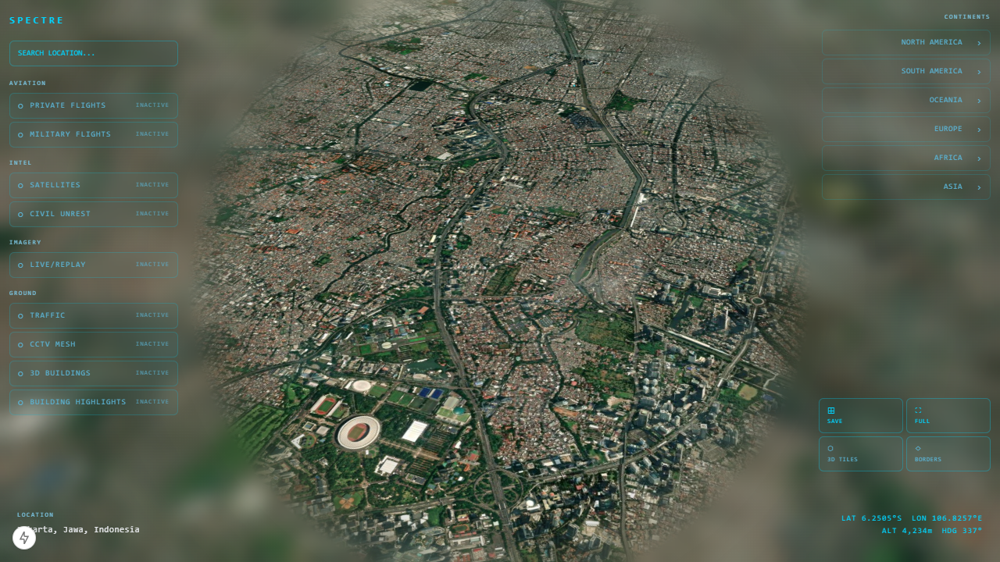
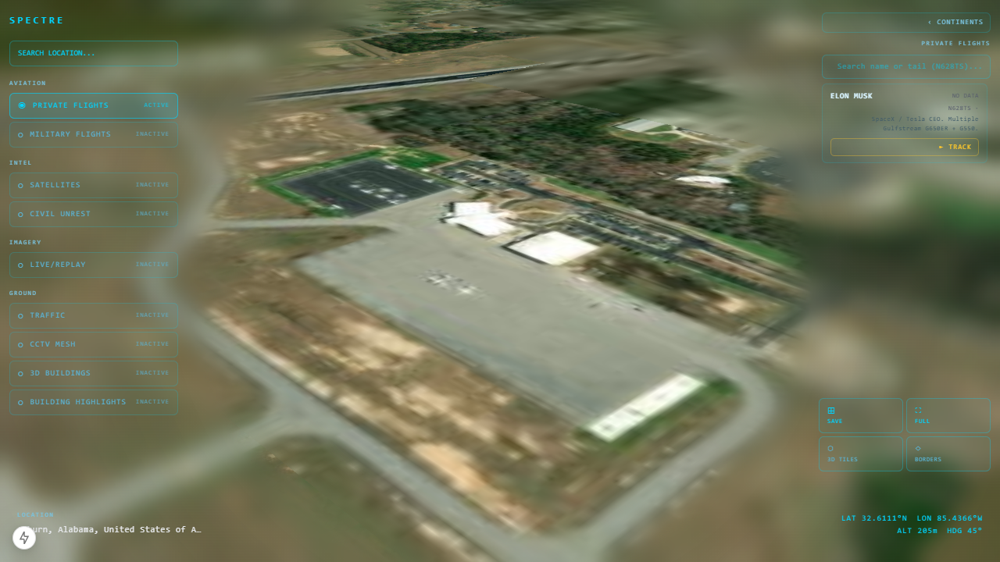
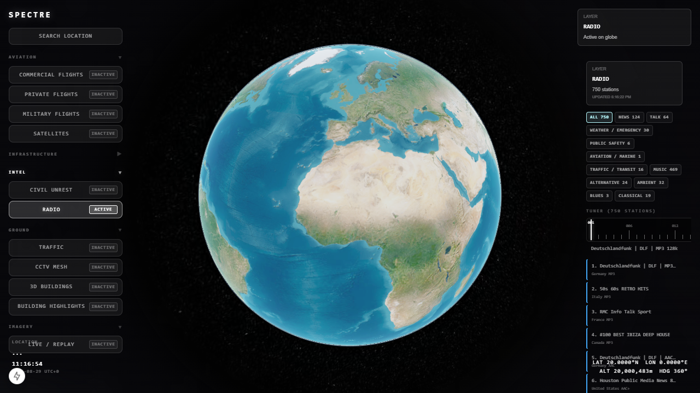
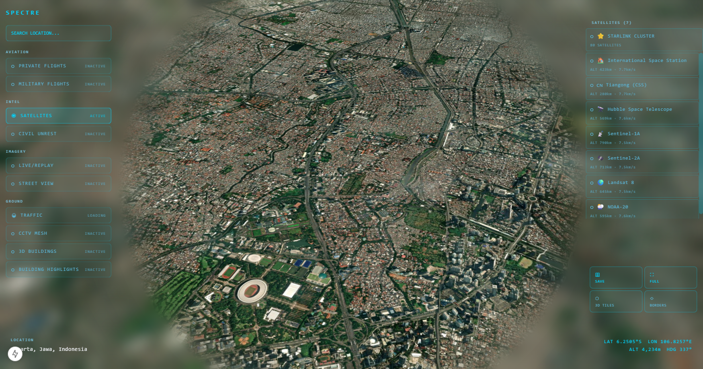

<div align="center">

# SPECTRE V2

### A tactical OSINT globe: live flights, satellites, civil unrest, earthquakes, traffic, CCTV, and imagery on a 3D Earth.

Next.js 15 + React 19 + Cesium. A single-pane situational awareness dashboard that aggregates public intelligence feeds onto an interactive 3D globe with a tactical aesthetic.



</div>

---

## Origin

This project exists because of [Bilawal Sidhu's God's Eye View (GEV)](https://github.com/bilawalsidhu/gev), the vanilla-JS 3D globe that went viral on YouTube and later got open-sourced. Full credit to Bilawal for popularizing the format and proving there's an appetite for this kind of live, public-signal OSINT globe.

**Spectre V1 was a proof of concept.** It was built *before* GEV's code was released, working only from what was visible in the YouTube videos. The goal was to test whether the same idea, a tactical OSINT dashboard on a 3D globe, could be built on Next.js + React + Cesium instead of vanilla JS. V1 worked, but it was rough: Indonesia-centric, limited layers, no real architecture. It proved the concept and nothing more.

**Spectre V2 is the serious build.** Once GEV was open-sourced, I spent time in the codebase, tested every layer, and took notes on what worked and what I wanted to do differently. V2 is the result: a from-scratch rebuild that keeps what made GEV compelling (live data on a 3D globe, atmosphere treatment, per-class 3D aircraft models) and pushes further on architecture, UI, and the intelligence layer stack. A modern component framework, a cleaner panel philosophy, free-form camera movement, and a set of OSINT layers GEV doesn't have.

---

## What Spectre V2 has that GEV doesn't

| | Spectre V2 | GEV |
|---|---|---|
| **Architecture** | Next.js 15 + React 19 + Resium (component model, API routes, SSR) | Vite + vanilla JS (no framework, no React) |
| **State** | Zustand store with per-feature slices | Plain JS module scope, no state library |
| **Base map** | Esri World Imagery (keyless, no API key for the globe itself) | Google Photorealistic 3D Tiles (requires Google Maps API key) |
| **Panel layout** | Left sidebar toggles + right context panel. Whatever you toggle on the left, the right panel becomes its complement | Multi-panel accordion with collapsing, pinning, localStorage positions |
| **Civil unrest** | GDELT + RSS + ACLED + CIVICUS + Mastodon + Reddit + Telegram + YouTube + ReliefWeb + UCDP aggregation, instability scoring, verification levels, country/province grouping | Not available |
| **Private flights** | OpenSky with notable people registry (VIP tracking), aircraft classification, dead reckoning interpolation | Commercial flights only |
| **Military flights** | adsb.lol with solo/focus mode, trajectory overlay, aircraft type classification | Not available |
| **Infrastructure** | Dams (USACE) and data centers as GeoJSON layers | Not available |
| **Borders and regions** | Country/state GeoJSON borders with camera-height switching, region hover index, World Bank indicators | Not available |
| **Satellite imagery** | Sentinel-2 WMS + NASA GIBS WMTS with time navigation and region presets | Not available |
| **Server-side caching** | Next.js API routes proxy and cache external APIs (rate limit management, response validation) | Client-side fetches directly |
| **Type safety** | TypeScript end to end | JavaScript |
| **Testing** | Playwright E2E tests per feature | Not available |

### What GEV has that Spectre V2 doesn't (yet)

GEV has features Spectre V2 does not currently implement, and acknowledging them is more useful than pretending otherwise:

- **Voice control** via a realtime AI agent
- **GLSL sensor looks**: CRT, NVG, FLIR/thermal, Noir, Snow post-processing
- **Ship/vessel tracking** (MarineTraffic)
- **Cockpit view**: camera rides inside a tracked flight down to terrain
- **Contacts roster**: 250 km proximity list around a tracked target
- **Scene director**: cinematic camera tour capture
- **Share links**: camera, style, layers, and tracked target serialized into a URL
- **Detection overlay**: screen-space bounding boxes and IDs on everything in view

---

## Features

Layer toggles are organized into five groups in the left sidebar. Each toggle activates a globe layer and its corresponding right panel.

### Aviation
- **Commercial Flights** - OpenSky API, dead reckoning interpolation, trail rendering, per-class 3D aircraft models (787, ATR-72, Citation, Bell 206, MQ-9, C172), camera follow
- **Private Flights** - OpenSky with notable people registry, VIP tracking, aircraft classification
- **Military Flights** - adsb.lol API, billboard rendering, solo/focus mode, trajectory overlay
- **Satellites** - CelesTrak TLE propagation, 3D satellite models, ground tracks, orbit trajectories, Starlink cluster mode, tracking



### Infrastructure
- **Dams** - USACE dam locations as a local GeoJSON layer
- **Earthquakes** - USGS GeoJSON feed, depth-colored ground-clamped circles, floating magnitude labels, 60s polling
- **Data Centers** - Datacenter locations as a local GeoJSON layer

### Intel
- **Civil Unrest** - Multi-source event aggregation (GDELT, RSS, ACLED, CIVICUS, Mastodon, Reddit, Telegram, YouTube, ReliefWeb, UCDP), event clustering, verification levels, instability scoring, country/province grouping
- **Radio** - Internet radio directory, station markers with country/category clustering, playback



### Ground
- **Traffic** - TomTom flow tiles, Overpass road data, animated vehicle dots, congestion recoloring, road class visibility, camera-altitude gating
- **CCTV Mesh** - Multi-source camera aggregation (Windy, Shodan, 511, LTA, TfNSW), POV pyramids, camera calibration, road snapping, snapshot API
- **3D Buildings** - OSM Buildings (Cesium Ion asset 96188), Google Photorealistic 3D Tiles, building picking, hover popups
- **Building Highlights** - Highlight layer for picked buildings

### Imagery
- **Live / Replay** - Sentinel-2 WMS (Copernicus) and NASA GIBS WMTS (MODIS Terra true color), time-based queries with monthly/weekly granularity, region presets, EOX fallback



---

## Tech Stack

| Layer | Technology |
|---|---|
| Framework | Next.js 15.1.6 (App Router) |
| UI | React 19 |
| Globe | Cesium 1.143 + Resium 1.18 |
| Styling | Tailwind CSS v4 (layout) + inline styles (tactical components) |
| State | Zustand 5 |
| Orbits | satellite.js |
| CSV | papaparse |
| RSS | rss-parser |
| Vector tiles | @mapbox/vector-tile, pbf |
| Testing | Playwright |
| Language | TypeScript |

---

## Architecture

```
src/
  app/
    api/                    # Next.js API routes (proxy + cache external APIs)
      adsblol/              # Military flights
      cctv/                 # CCTV aggregation + frame snapshots
      celestrak/            # Satellite TLEs
      events/               # Civil unrest aggregation
      flights/track/        # Flight track enrichment
      gdelt/                # GDELT DOC API
      geojson/              # GeoJSON proxy
      opensky/              # Commercial + private flights
      overpass/             # Overpass road data
      radio/stations/       # Radio directory
      tomtom/               # Traffic flow tiles
      usgs/                 # Earthquakes
    globals.css
    layout.tsx
    page.tsx                # Root page, mounts all overlays
  components/
    CesiumGlobe.tsx         # Main globe component
    TacticalHUD.tsx         # Left sidebar (layer toggles, search)
    RightPanel.tsx          # Right context panel
    FlightDetailPanel.tsx   # Selected flight details
    FlightTrajectoryOverlay.tsx
    SatelliteDetailPanel.tsx
    FeatureDetailPanel.tsx  # Dams, data centers, etc.
    CctvDetailPanel.tsx
    EarthquakeOverlay.tsx
    CivilUnrestOverlay.tsx
    LocalInfrastructureOverlay.tsx
    RegionPopup.tsx         # Country/state hover popup
    radio/                  # Radio overlay, panel, tuner
    ...
  globe/
    viewer-init.ts          # Cesium viewer creation
    scene-config.ts         # Scene properties, atmosphere
    render-governor.ts      # Idle render governor
    city-index.ts           # City search index
    region-index.ts         # Region hover index
    controls/
      keyboard.ts           # Camera-relative keyboard controls
      hover.ts              # Entity hover picking
    layers/
      registry.ts           # Layer registry
      manager.ts            # Layer lifecycle manager
      flights.ts            # Commercial + private flights
      satellites.ts         # Satellites
      cctv.ts               # CCTV cameras
      buildings.ts          # 3D buildings
      traffic/              # Traffic flow (6 modules)
      ...
    radio/                  # Radio engine, clustering, playback
  lib/
    sources/                # External data source clients
      gdelt.ts, acled.ts, cctv.ts, firms.ts, reddit.ts,
      telegram.ts, youtube.ts, mastodon.ts, reliefweb.ts, ...
    opensky-auth.ts         # OpenSky OAuth2
    tomtom-tiles.ts         # TomTom flow tile client
    unrest-pipeline.ts      # Civil unrest aggregation pipeline
    viptrack-db.ts          # Notable people registry
    ...
  store/
    globe-store.ts          # Zustand global state
```

### Design principles

- **Per-feature organization**: each layer has its own globe layer module, components, API routes, and types.
- **Right panel complements left toggle**: activating a layer on the left sidebar surfaces its context panel on the right.
- **Server-side proxying**: all external API calls go through Next.js API routes, which handle caching, rate limiting, and response validation. No client-side direct fetches to third-party APIs.
- **Render governor**: the Cesium render loop is idle by default and only renders on demand (camera move, layer toggle, data update), cutting GPU burn when the globe is stationary.
- **Camera-altitude LOD**: layers gate their detail level based on camera height. Flights swap from billboard to 3D model as you close in. Traffic only renders below a threshold altitude.

---

## Quick Start

Requires Node.js 18+.

```bash
# 1. Install dependencies
npm install

# 2. Copy environment variables
cp .env.example .env.local
# Fill in the API keys you want (all optional; layers without their key stay off)

# 3. Run the dev server
npm run dev

# 4. Open http://localhost:3000
```

The Cesium static assets are copied to `public/cesium/` automatically during `npm install` via a postinstall hook.

### Environment variables

All keys are optional. The globe and most layers work without any keys. Adding keys unlocks additional data sources.

| Key | Scope | Purpose |
|---|---|---|
| `NEXT_PUBLIC_CESIUM_TOKEN` | Client | Cesium Ion (terrain, OSM 3D Buildings) |
| `NEXT_PUBLIC_GOOGLE_API_KEY` | Client | Google Photorealistic 3D Tiles |
| `GOOGLE_MAPS_API_KEY` | Server | Street View snapshots for CCTV |
| `OPENSKY_CLIENT_ID` | Server | OpenSky OAuth2 (flights) |
| `OPENSKY_CLIENT_SECRET` | Server | OpenSky OAuth2 (flights) |
| `RAPIDAPI_KEY` | Server | Flight track enrichment |
| `TOMTOM_API_KEY` | Server | Traffic flow tiles |
| `ACLED_EMAIL` | Server | ACLED armed conflict data |
| `ACLED_KEY` | Server | ACLED armed conflict data |
| `FIRMS_MAP_KEY` | Server | NASA FIRMS active fire detection |
| `SHODAN_API_KEY` | Server | CCTV camera discovery |
| `WINDY_API_KEY` | Server | Windy webcam API |
| `NY511_API_KEY` | Server | New York 511 traffic cameras |
| `LTA_API_KEY` | Server | Singapore LTA traffic cameras |
| `TFNSW_API_KEY` | Server | Transport for NSW cameras |

See [`.env.example`](.env.example) for the full list.

---

## Testing

```bash
npx playwright test
```

E2E tests cover layer toggling, CCTV, satellites, and private flights. See the `tests/` directory.

---

## Documentation

- [`docs/FEATURES.md`](docs/FEATURES.md) - Complete reference of every button, toggle, and control, what it does, and how it is implemented
- [`docs/CLEANUP-PLAN.md`](docs/CLEANUP-PLAN.md) - Repository cleanup notes (deletions, merges, .gitignore changes)
- [`docs/screenshots/`](docs/screenshots/) - UI screenshots

---

## Credits

- [Bilawal Sidhu](https://github.com/bilawalsidhu) for God's Eye View, which inspired this project
- [Cesium](https://cesium.com/) for the 3D globe engine
- [OpenSky Network](https://openskynetwork.org/) for flight data
- [adsb.lol](https://adsb.lol/) for military flight data
- [CelesTrak](https://celestrak.org/) for satellite TLEs
- [USGS](https://earthquake.usgs.gov/) for earthquake data
- [GDELT](https://www.gdeltproject.org/) for global event data
- [ACLED](https://acleddata.com/) for armed conflict data
- [NASA FIRMS](https://firms.modaps.eosdis.nasa.gov/) for fire data
- [NASA GIBS](https://earthdata.nasa.gov/gibs) for daily satellite imagery
- [Copernicus](https://dataspace.copernicus.eu/) for Sentinel-2 imagery
- [TomTom](https://developer.tomtom.com/) for traffic data
- [Overpass](https://overpass-api.de/) for OpenStreetMap road data

---

## License

[MIT](LICENSE)
